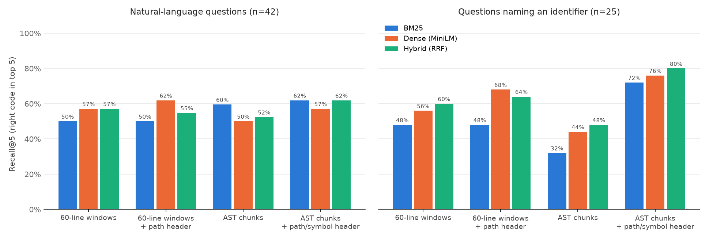

# code-compass

*Ask questions about a large code base and get pointed to the right function, with a measured answer to "how good is the search?".*

[Version française](README.fr.md)

## Why

I wanted an assistant that could search a huge code base smartly, because the hardest part of a first open-source contribution is finding *where* things happen. `grep` works when you already know the name of the function; it does not help with "where are the bootstrap samples drawn for each tree?".

code-compass is a retrieval-augmented generation (RAG) pipeline built for source code. It splits a repository into meaningful pieces, indexes them in ChromaDB and a BM25 index, retrieves the most relevant pieces for a question, and can ask Claude to answer with citations to exact files and lines.

Rather than stopping at a demo, I built a benchmark to measure which design choices actually help.

## What it does

```text
$ code-compass search "How is the initial set of cluster centers chosen so that the centers are spread out?" -k 3
 1. sklearn/cluster/_kmeans.py:181-260  _kmeans_plusplus  [function]  score=0.032
 2. sklearn/cluster/_kmeans.py:1506-1563  KMeans.fit  [method]  score=0.029
 3. sklearn/cluster/_kmeans.py:937-948  _BaseKMeans._validate_center_shape  [method]  score=0.029
```

`code-compass ask "..."` sends the retrieved chunks to Claude as separate documents with citations enabled, so every claim in the answer links back to a quoted span of a specific file and symbol.

## How it works

1. **Chunking.** Two strategies are compared:
   - *Line windows*: 60 lines with 15 lines of overlap, the usual baseline.
   - *AST chunks*: the file is parsed with [tree-sitter](https://tree-sitter.github.io/). Each function and method becomes a chunk. Each class gets a summary chunk (signature, docstring, attributes and the list of its methods). Top-level code (imports, constants) is grouped into blocks. Functions longer than 80 lines are split into windows that all repeat the signature.
2. **Contextual header (optional).** Before indexing, each chunk can be prefixed with one line such as `# sklearn/cluster/_kmeans.py :: KMeans.fit (method, lines 1506-1563)`. A method body alone rarely says which class or file it belongs to; the header puts that back.
3. **Retrieval.**
   - *BM25* with a code-aware tokenizer: `check_is_fitted` and `KMeansPlusPlus` are indexed whole *and* split into sub-words, so "is fitted" still matches.
   - *Dense*: embeddings in a persistent ChromaDB collection (cosine distance). The default model is all-MiniLM-L6-v2 through ONNX Runtime, so no GPU or PyTorch is needed. Any sentence-transformers model can be plugged in with `--embedding`.
   - *Hybrid*: reciprocal rank fusion (RRF) of the two lists. It only uses ranks, so there are no scores to normalize.
4. **Answering.** Claude receives the top chunks as citable documents and is told to say so when the excerpts do not contain the answer.

## Benchmark

**Corpus:** [scikit-learn 1.5.2](https://github.com/scikit-learn/scikit-learn/tree/1.5.2), `sklearn/` package without tests: 269 Python files and about 186,000 lines, which gives 6,408 AST chunks or 4,450 line windows.

**Questions:** [67 hand-written questions](eval/questions.yaml), each with the function(s) that answer it, checked against the source.
- 42 *natural-language* questions that avoid code names ("How is a seed or None turned into a random number generator instance?"). This is what a newcomer would type.
- 25 *keyword* questions that name an identifier ("How does StratifiedShuffleSplit generate its splits?").

**Relevance** is defined on code, not on chunk ids, so every chunking strategy is judged the same way: a retrieved chunk counts if it comes from an expected file and overlaps the expected symbol's lines.



| Index | Retrieval | Recall@1 | Recall@5 | Recall@10 | MRR@10 | Right file in top 5 | Latency (p50) |
|---|---|---|---|---|---|---|---|
| 60-line windows | BM25 | 33% | 49% | 66% | 0.41 | 93% | 1 ms |
| 60-line windows | Dense | 22% | 57% | 69% | 0.37 | 93% | 206 ms |
| 60-line windows | Hybrid | 28% | 58% | 72% | 0.39 | 93% | 201 ms |
| 60-line windows + path header | BM25 | 33% | 49% | 69% | 0.42 | 91% | 2 ms |
| 60-line windows + path header | Dense | **40%** | 64% | 78% | **0.50** | 96% | 197 ms |
| 60-line windows + path header | Hybrid | 30% | 58% | 81% | 0.43 | 96% | 201 ms |
| AST chunks | BM25 | 27% | 49% | 64% | 0.36 | 87% | 1 ms |
| AST chunks | Dense | 24% | 48% | 58% | 0.34 | 88% | 194 ms |
| AST chunks | Hybrid | 27% | 51% | 69% | 0.37 | 90% | 204 ms |
| AST chunks + path/symbol header | BM25 | 31% | 66% | 73% | 0.43 | 91% | 1 ms |
| AST chunks + path/symbol header | Dense | 31% | 64% | 72% | 0.45 | 96% | 202 ms |
| **AST chunks + path/symbol header** | **Hybrid** | 34% | **69%** | **84%** | **0.50** | **97%** | 204 ms |

Latency is the query time on a 4-core CPU; dense search is dominated by embedding the question.

### What I learned

- **Context matters more than chunk boundaries.** AST chunking *alone* is no better than line windows, and slightly worse: a method cut out of its class loses the name of the class and of the file. Adding a one-line header with the path and the qualified symbol is the single biggest improvement (Recall@10 from 69% to 84% for hybrid search).
- **The header makes AST chunks pay off.** With the header, AST chunks beat line windows at Recall@5 (69% vs 58%) and on questions naming an identifier (80% vs 64% Recall@5), because the symbol name is now in the indexed text.
- **Hybrid search is the safest choice.** It has the best Recall@10 in all four index configurations. BM25 is strong when the question names the code; embeddings help when it does not.
- **Finding the file is easy, finding the function is not.** The right file is in the top 5 for 97% of questions, but the exact function only for 69%. The misses are usually neighbours: the `StratifiedKFold` class summary instead of its `_make_test_folds` method, or `BaseShuffleSplit.split` instead of `train_test_split`.
- **Caveat:** with 67 questions, one question is 1.5 points, so differences under about 5 points should not be over-read.

## Usage

```bash
pip install -e .                     # add ".[llm]" for `ask`, ".[st]" for other embedding models
git clone --depth 1 --branch 1.5.2 https://github.com/scikit-learn/scikit-learn.git corpora/scikit-learn

code-compass index corpora/scikit-learn               # AST chunks + header (default)
code-compass search "where is the confusion matrix computed?"
ANTHROPIC_API_KEY=... code-compass ask "How does early stopping work in HistGradientBoosting?"

code-compass bench corpora/scikit-learn               # rebuild the table above (about 10 min on CPU)
python scripts/plot_results.py                        # redraw the chart
```

Options: `--chunker ast|lines`, `--no-header`, `--mode bm25|dense|hybrid`, `--embedding <sentence-transformers model>`.

## Project layout

```text
codecompass/
  chunking.py   line windows and tree-sitter AST chunks
  search.py     code-aware tokenizer, BM25, dense (ChromaDB) and hybrid (RRF) retrievers
  index.py      build / load an index (chunks as JSONL + ChromaDB collection)
  evaluate.py   symbol resolution, Recall@k, MRR, nDCG
  generate.py   answers with Claude and citations
  cli.py        index | search | ask | bench
eval/questions.yaml   the benchmark
results/bench.json    raw results, per question
```

## Limitations and next steps

- Only one embedding model was measured, a general-purpose text model. A code-specific model (for example `jinaai/jina-embeddings-v2-base-code`) can be tried with `--embedding` and should help on natural-language questions.
- A cross-encoder reranker on the top 20 hybrid results is the obvious next step for Recall@1.
- Answer quality is not benchmarked yet: the next step is to grade Claude's answers on the same questions (correctness and whether every claim is supported by a citation).
- Python only for now; tree-sitter makes other languages a matter of adding grammars.

## License

MIT
